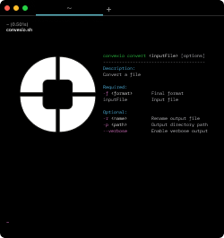

<p align="center">
  
</p>

<h1 align="center">Convexio</h1>

<p align="center">
  Modern, scalable, and efficient solution for fast local file conversion via CLI.<br />
  <a href="https://convexio.sh"><strong>→ Website</strong></a>
  ·
  <a href="https://github.com/youruser/yourrepo/issues">Report Bug</a>
  ·
  <a href="https://github.com/youruser/yourrepo/issues">Request Feature</a>
</p>

---

## 🚀 Features

* ⚡ Fast & efficient local file processing via CLI
* 🧠 Clean architecture with a focus on testability
* 🔌 Plugin system for easy extensibility
* 🧪 100% tested with JUnit

---

## 💠 Installation

```bash
git clone https://github.com/youruser/yourrepo.git
cd yourrepo
./gradlew build
```

---

## 🧪 Running Tests

```bash
./gradlew test
```

Or run tests via the test menu in IntelliJ / WebStorm.

---

## 🤩 Example Usage (Java)

```java
FormatConverter<String, String> converter = new MyConverter();
String result = converter.convertTo("input");
```

---

## 🧰 Example Usage (CLI)




```bash
convexio -i ./input/file.docx -o ./output/file.txt -p pretty
```

**Parameters:**

* `-i` or `--input` – Path to the input file
* `-o` or `--output` – Path to the output file
* `-r` or `--rename` – Renames Original Path

> Flags may vary depending on implementation.

---

## 🌐 Project Website

[https://convexio.sh](https://convexio.sh)

---

## 📄 License

This project is licensed under the [MIT License](LICENSE).

---

## 👤 Author

**dev.jaron** – [GitHub](https://github.com/devjaron) • [Website](https://convexio.sh)

---

> Crafted with ❤️ by dev.jaron
