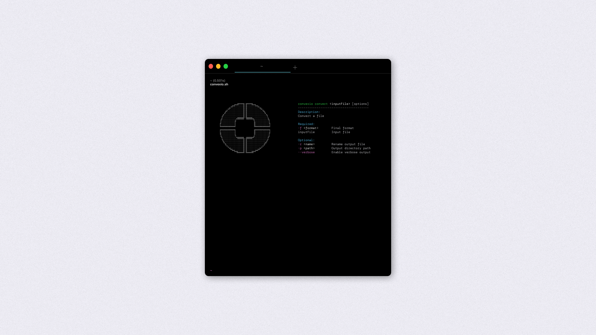

<p align="center">
 
</p>

<h1 align="center">Omni</h1>

<p align="center">
  Modern, scalable, and efficient solution for fast local file conversion via CLI.<br />
  <a href="https://getomni.sh"><strong>→ Website</strong></a>
  ·
  <a href="https://github.com/youruser/yourrepo/issues">Report Bug</a>
  ·
  <a href="https://github.com/youruser/yourrepo/issues">Request Feature</a>
</p>

---

## 📦 What is Omni?

**Omni** is your no-cloud, developer-first CLI tool for blazing fast file format conversion. No telemetry, no lock-in — just raw performance and clean extensibility.

> Born from the need for local-first tools with real power, Omni is engineered for devs who value speed, control, and clarity. ⚙️

---

## 🤔 Why Omni?

* You don’t want cloud uploads.
* You want extensibility without bloat.
* You care about performance.

Omni is built for:

* Developers 🧑‍💻
* Data wranglers 📊
* Automation engineers 🤖
* Security-conscious users 🔐

---

## 🔧 How It Works

Omni uses a plugin-like strategy system to select and run the right converter for each file type. Its clean, hexagonal architecture ensures easy testing, maintenance, and extension.

 <!-- Optional placeholder -->

---

## 🚀 Features

* ⚡ Fast & efficient local file processing via CLI
* 🧠 Clean architecture with a focus on testability
* 🔌 Plugin system for easy extensibility
* 🧱 Hexagonal architecture (Ports & Adapters)
* 🧪 100% tested with JUnit

---

## 💠 Getting Started

```bash
git clone https://github.com/youruser/yourrepo.git
cd yourrepo
./gradlew build
```

To run:

```bash
java -jar omni.jar convert -i ./input.docx -o ./output.pdf -r docxReader -t pdf
```

---

## ⚙️ Activation System

Omni includes an optional license activation system for Pro features. Activation is simple and local:

```bash
onmi activate --key "YOUR_LICENSE_KEY"
omni deactivate
omni status
```

* 🔑 License keys are one-time purchasable
* 🖥️ Bound to your device fingerprint
* 📁 Stored in `~/.omni/config.json`
* 📬 Keys are delivered by email

No cloud validation. Fully offline-capable.

---

## 🧪 Running Tests

```bash
./gradlew test
```

Or run tests via IntelliJ.

---

## ✨ Example Usage (Java)

```java
FormatConverter<String, String> converter = new MyConverter();
String result = converter.convertTo("input");
```

---

## 🧰 Example Usage (CLI)



```bash
omni -i ./input/file.docx -o ./output/file.txt -p pretty
```

**Parameters:**

* `-i` or `--input` – Path to the input file
* `-o` or `--output` – Path to the output file
* `-r` or `--rename` – Renames original path

> Flags may vary depending on implementation.

---

## 🌐 Project Website

[https://getomni.sh](https://getomni.sh)

---

## 🤝 Contributing

Pull requests welcome! For major changes, open an issue first to discuss what you’d like to change.

---

## 📄 License

This project is licensed under the [MIT License](LICENSE).

---

## 👤 Author

**dev.jaron** – [GitHub](https://github.com/devjaron) • [Website](https://getomni.sh)

---

> Crafted with ❤️ by dev.jaron – Last updated: June 2025 ✅
